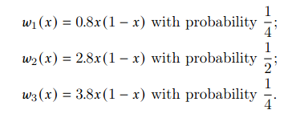

# IFS-DMD

This repository simulates predicting an iterated function system generated by the following logistic maps on [0, 1] and probabilities using Higher order Dynamic Mode Decomposition:

# Requirements

* pydmd
* numpy 
* scipy

# Run

Set initial condition inside onedim_dmd.py and

python onedim_dmd.py

Results for initial condition, x=0.5

