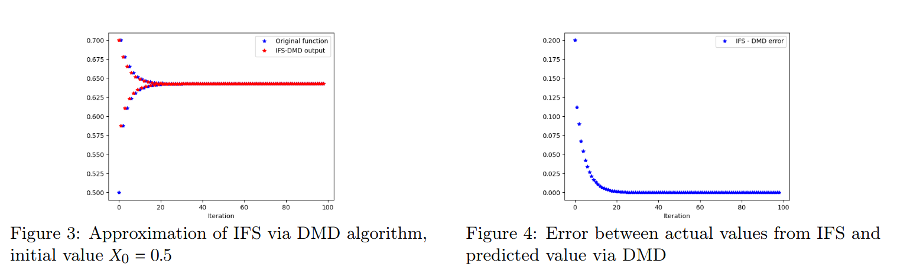

# IFS-DMD

  <h1 align="center">Dynamic Mode Decomposition and Koopman Operator for Iterated Function Systems</h1>
  

    Ramen Ghosh, Mahmoud Tahmasebi, Marion McAfee
  

  <h3 align="center"><a href="https://ieeexplore.ieee.org/document/10284085">Paper</a>
  

This repository contains predicting an iterated function system generated by the following logistic maps on [0, 1] and probabilities using Higher Order Dynamic Mode Decomposition:

# Requirements

* pydmd
* numpy 
* scipy

# Run

Set initial condition inside onedim_dmd.py and

python onedim_dmd.py

Results for initial condition, x=0.5

